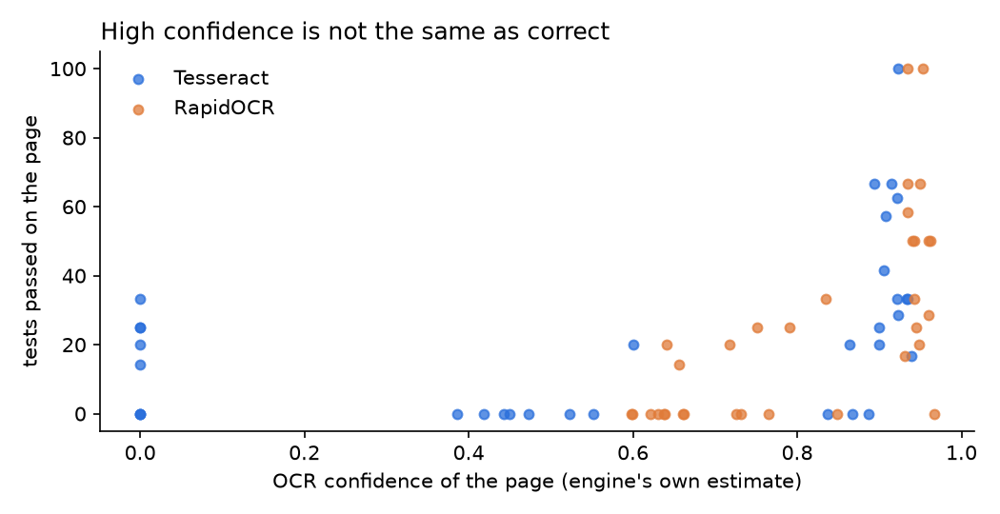
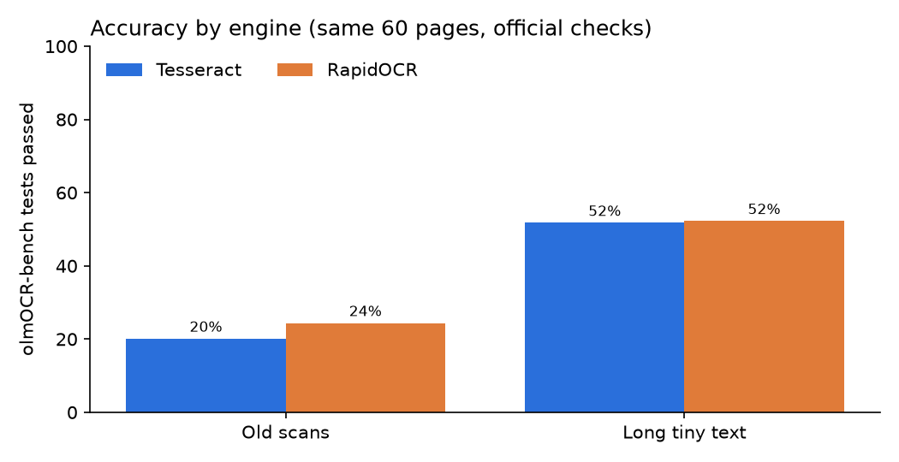
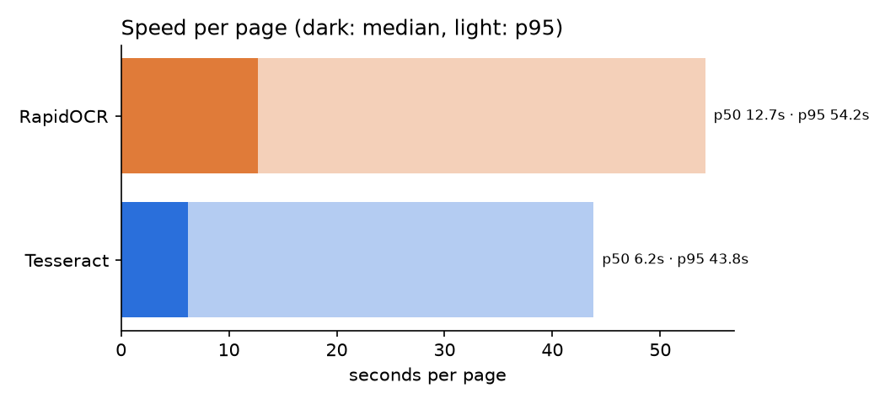

# @ctxwise/ai-sdk-liteparse

[Vercel AI SDK](https://ai-sdk.dev) middleware that turns chat attachments — PDFs, scans, Word, Excel,
PowerPoint, images — into text the model can read, using [LiteParse](https://github.com/run-llama/liteparse)
in your own Node process. No parsing server. A vision model is used only where OCR is not confident.

```bash
npm i @ctxwise/ai-sdk-liteparse
```

```ts
import { openai } from '@ai-sdk/openai';
import { liteparseAttachments } from '@ctxwise/ai-sdk-liteparse';
import { streamText, wrapLanguageModel } from 'ai';

const model = wrapLanguageModel({
  model: openai('gpt-5-mini'),
  middleware: liteparseAttachments({ visionModel: openai('gpt-5-mini') }),
});

// file parts in user messages are parsed before the model sees them
const result = streamText({ model, messages });
```

Every file part in a user message is replaced by what the model can read, wrapped in `<document name="...">`.
Parsed files are cached by content hash, so chat history that re-sends a file every turn parses it once.

## Why

- **In-process.** LiteParse is a native Node module (PDFium + Tesseract). No Python, no Docker sidecar, no
  network hop for the common case.
- **OCR first, vision second.** Scans and pictures are OCR'd; only what OCR can't read confidently goes to a
  vision model — which is where the tokens and latency go.
- **Pluggable OCR.** Built-in Tesseract by default, an external OCR service (e.g. RapidOCR) when you want it,
  or no OCR at all. The package itself stays pure TypeScript with one runtime dependency.
- **Measured.** Engines and thresholds are chosen from a public benchmark with human-verified checks
  ([results](#benchmark)), not from confidence scores alone.

## How files are routed

```
PDF  ─┐
DOCX ─┤                    text, tables, headings ──────────► text
PPTX ─┼─► LiteParse ─┬─► pictures ─────────┐
XLSX ─┘              └─► pages without     │
                         usable text ──────┼─► processImage()
PNG / JPEG / WEBP / TIFF ──────────────────┘

processImage():  OCR ─► confidence ≥ minConfidence ?  OCR text  :  vision model
```

- **Native text first.** Text, tables and headings come straight from the file — no OCR, exact.
- **One image pipeline.** An uploaded photo, a chart inside a DOCX and a scanned PDF page all go through the
  same `processImage()`.
- **Vision model.** With `visionModel`, a low-confidence image is turned into text by that model, so the main
  model gets text only. Without it, the image itself goes to the main model.
- **Text files** (`text/*`, JSON, XML, YAML, ...) are read as-is. **Other types** get a short note; PDFs and
  images the model reads natively pass through untouched if parsing fails.

## OCR engines

Pick the engine with the `ocr` option:

```ts
liteparseAttachments({ ocr: { engine: 'tesseract' } });                               // default
liteparseAttachments({ ocr: { engine: 'server', serverUrl: 'http://rapidocr:8829' } }); // OCR service
liteparseAttachments({ ocr: { engine: 'none' } });                                    // no OCR
```

| engine | runs | best for |
|---|---|---|
| `tesseract` (default) | inside LiteParse, in your process | most apps; zero setup |
| `server` | any HTTP service speaking LiteParse's [`POST /ocr` contract](https://github.com/run-llama/liteparse/blob/main/OCR_API_SPEC.md) | offloading OCR to its own scalable service; other engines |
| `none` | – | native text + every image to the vision model; fastest parse, most vision tokens |

**RapidOCR service.** [ocr/rapidocr](ocr/rapidocr) is a ready server: PP-OCRv5 on ONNX Runtime, CPU only,
models baked into the image at build time. It is not part of the npm package and runs only when you start it:

```bash
docker compose --profile rapidocr up -d
```

At scale, run it as its own service (e.g. an ECS service behind an internal load balancer) and scale it
independently of the app. `OCR_THREADS` (default 4) sets ONNX threads per request; each container handles
`CPUs / OCR_THREADS` requests at once and queues the rest.

## Choosing `minConfidence`

OCR engines report a confidence per line. It is the engine's own estimate, **not a measure of correctness**,
and engines calibrate it differently — RapidOCR's scores sit higher than Tesseract's on the same pages.



Per page, on [olmOCR-bench](#benchmark) (share of human-verified checks the OCR text passes):

| page confidence | Tesseract | RapidOCR |
|---|---|---|
| below 0.85 | 0–20% | 0–22% |
| 0.85 – 0.90 | 24% | – |
| 0.90 – 0.93 | 50% | – |
| 0.93 and above | 28%¹ | 48–53% |

¹ 3 pages.

So the default threshold depends on the engine: **0.90 for Tesseract, 0.93 for an OCR server** (tuned on
RapidOCR), exported as `MIN_CONFIDENCE`. Below it, OCR text fails most checks and the page goes to the vision
model. These defaults are provisional until the vision-model run is in the benchmark: the final choice is the
cheapest threshold whose routed score is within 1 point of the best (see [bench/README.md](bench/README.md)).

For your own documents, log what the pipeline sees and set `minConfidence` explicitly:

```ts
liteparseAttachments({ minConfidence: 0.9, onOcr: (confidence, toVision) => metrics.record({ confidence, toVision }) });
```

## Benchmark

[olmOCR-bench](https://huggingface.co/datasets/allenai/olmOCR-bench) `old_scans` + `long_tiny_text`: the first
30 pages of each (60 pages, 363 human-verified checks), run through this package's real pipeline in the Linux
image and scored with olmOCR's official scorer. OCR text kept on every page to measure the engines alone.

| engine | score (± 95% CI) | old scans | long tiny text | median / p95 per page |
|---|---|---|---|---|
| Tesseract | 35.9% ± 4.6 | 20.1% | 51.8% | 6.2 s / 43.8 s |
| RapidOCR (PP-OCRv5) | 38.3% ± 4.9 | 24.4% | 52.3% | 12.7 s / 54.2 s |
| Vision model only (`none`) | pending² | | | |

² Awaiting the vision-model run (gpt-5-mini via OpenRouter).




Takeaways:

- **RapidOCR is not measurably more accurate** on this sample — the gap is inside the confidence interval —
  and it is about 2x slower on CPU. Keep Tesseract as the default; use the RapidOCR service to move OCR off
  the app's CPUs, not for accuracy.
- **Old scans are hard for any OCR engine** (20–24%): this is where the vision model earns its tokens.
- **Most "long tiny text" pages have a real text layer**: they parse natively in ~0.1 s, no OCR at all.

Timings come from a shared dev machine that was also running another heavy job; compare them, don't size
capacity from them. Method, commands and caveats: [bench/README.md](bench/README.md).

## Deploy (Linux / ECS)

PDFs and images need nothing but the npm package. Office files need LibreOffice. Add to your app image
(see [Dockerfile](Dockerfile)):

```dockerfile
RUN apt-get update && apt-get install -y --no-install-recommends ca-certificates fonts-dejavu-core \
      libreoffice-writer libreoffice-calc libreoffice-impress && rm -rf /var/lib/apt/lists/*
# Tesseract's language data; without it LiteParse downloads it on the first OCR
ADD --checksum=sha256:8280aed0782fe27257a68ea10fe7ef324ca0f8d85bd2fd145d1c2b560bcb66ba \
    https://github.com/tesseract-ocr/tessdata_best/raw/main/eng.traineddata /usr/share/tessdata/eng.traineddata
ENV TESSDATA_PREFIX=/usr/share/tessdata
```

On small tasks (2 vCPU / 4 GB):

- Peak memory in the benchmark was 850–920 MB per process on dense scans.
- For a hard per-document deadline and crash isolation, use a worker pool:
  `liteparse: { poolSize: 1, parseTimeoutMs: 60_000 }` — each worker is a separate process.
- `ocr.numWorkers` already caps at `min(4, CPUs)`; keep `ocr.dpi` at 150 unless scans need 200.
- Lower `cacheMB` and `maxFileBytes` if the task runs other work.

## Options

| option | default | |
|---|---|---|
| `ocr` | `{ engine: 'tesseract' }` | `engine`, `serverUrl`, `serverHeaders`, `language`, `dpi`, `numWorkers`, `tessdataPath` |
| `minConfidence` | per engine (`MIN_CONFIDENCE`) | OCR below this (0-1) goes to the vision model; an image with no text scores 0 |
| `visionModel` | – | e.g. `openai('gpt-5-mini')`; unset = images go to the main model |
| `visionPrompt` | see `DEFAULTS` | instruction for `visionModel` |
| `onOcr` | – | `(confidence, toVision) => void` for every OCR'd image |
| `maxImages` | `20` | pictures per document |
| `minImagePx` | `48` | smaller pictures (icons, bullets) are dropped |
| `maxTextChars` | `200000` | plain-text files are cut after this, with a note |
| `maxFileBytes` | `50 MB` | larger files are not parsed |
| `cacheMB` | `256` | in-memory cache of parsed files, by sha256 |
| `liteparse` | – | raw LiteParse config, e.g. `{ poolSize: 1, parseTimeoutMs: 60000 }` |
| `onError` | `console.warn` | errors that were turned into a note or a passthrough |

Also exported: `FileType`, `DOCUMENT_TYPES`, `IMAGE_TYPES`, `MODEL_TYPES`, `isDocumentType`, `isImageType`,
`isTextType`, `ocrConfidence`, `MIN_CONFIDENCE`, `DEFAULTS`.

## Develop

```bash
npm test                                               # LiteParse for real on the fixtures (Office skipped without LibreOffice)
docker build -t ai-sdk-liteparse . && docker run --rm ai-sdk-liteparse   # all tests on Linux, as in production
```

Benchmark: [bench/README.md](bench/README.md). Example: [examples/summarize-file.ts](examples/summarize-file.ts).

## License

MIT
